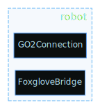

# Dimos Modules

Module is a subsystem on a robot that operates autonomously and communicates to other subsystems using standardized messages

Some examples of are:

- Webcam (outputs image)
- Navigation (inputs a map and a target, outputs a path)
- Detection (takes an image and a vision model like yolo, outputs a stream of detections)

A common module structure for controling a robot looks something like this, black blocks are modules, colored lines are connections and message types, it's ok if this doesn't make sense now,
it will by the end of this document.

```python output=assets/go2_basic.svg
from dimos.core.introspection.blueprint import dot2
from dimos.robot.unitree_webrtc.unitree_go2_blueprints import basic
dot2.render_svg(basic, "assets/go2_basic.svg")
```

<!--Result:-->


## Camera Module

Let's learn how to build stuff like the above, starting with a simple camera module.

```python session=camera_module_demo output=assets/camera_module.svg
from dimos.hardware.camera.module import CameraModule
from dimos.core.introspection.module import dot
dot.render_svg(CameraModule.module_info(), "assets/camera_module.svg")
```


We can always also print out Module I/O quickly into console via `.io()` call, we will do this from now on.

```python session=camera_module_demo ansi=false
print(CameraModule.io())
```

<!--Result:-->
```
┌┴─────────────┐
│ CameraModule │
└┬─────────────┘
 ├─ color_image: Image
 ├─ camera_info: CameraInfo
 │
 ├─ RPC set_transport(stream_name: str, transport: Transport) -> bool
 ├─ RPC start() -> str
 ├─ RPC stop() -> None
 │
 ├─ Skill video_stream (stream=passive, reducer=latest_reducer, output=image)
```

We can see that camera module outputs two streams:

- `color_image` with [sensor_msgs.Image](https://docs.ros.org/en/melodic/api/sensor_msgs/html/msg/Image.html) type
- `camera_info` with [sensor_msgs.CameraInfo](https://docs.ros.org/en/melodic/api/sensor_msgs/html/msg/CameraInfo.html) type

Offers two RPC calls, `start()` and `stop()`

As well as an agentic [Skill][skills.md] called `video_stream` (more about this later, in [Skills Tutorial][skills.md])

We can start this module and explore the output of it's streams in real time (this will use your webcam)

```python session=camera_module_demo ansi=false
import time

camera = CameraModule()
camera.start()
# now this module runs in our main loop in a thread. we can observe it's outputs

print(camera.color_image)

camera.color_image.subscribe(print)
time.sleep(1)
camera.stop()
```

<!--Result:-->
```
Out color_image[Image] @ CameraModule
<function Out.subscribe.<locals>.<lambda> at 0x7feb06af2fc0>
Image(shape=(480, 640, 3), format=RGB, dtype=uint8, dev=cpu, ts=2025-12-29 14:54:51)
2025-12-29T06:54:51.555218Z [warning  ] Trying to publish on Out Out color_image[Image] @ CameraModule without a transport [dimos/core/stream.py]
Image(shape=(480, 640, 3), format=RGB, dtype=uint8, dev=cpu, ts=2025-12-29 14:54:51)
2025-12-29T06:54:51.760800Z [warning  ] Trying to publish on Out Out color_image[Image] @ CameraModule without a transport [dimos/core/stream.py]
Image(shape=(480, 640, 3), format=RGB, dtype=uint8, dev=cpu, ts=2025-12-29 14:54:51)
2025-12-29T06:54:51.965721Z [warning  ] Trying to publish on Out Out color_image[Image] @ CameraModule without a transport [dimos/core/stream.py]
Image(shape=(480, 640, 3), format=RGB, dtype=uint8, dev=cpu, ts=2025-12-29 14:54:52)
2025-12-29T06:54:52.170731Z [warning  ] Trying to publish on Out Out color_image[Image] @ CameraModule without a transport [dimos/core/stream.py]
```

## Connecting modules

Let's load a standard 2D detector module and hook it up to a camera.

```python ansi=false session=detection_module
from dimos.perception.detection.module2D import Detection2DModule, Config
print(Detection2DModule.io())
```

<!--Result:-->
```
 ├─ image: Image
┌┴──────────────────┐
│ Detection2DModule │
└┬──────────────────┘
 ├─ detections: Detection2DArray
 ├─ annotations: ImageAnnotations
 ├─ detected_image_0: Image
 ├─ detected_image_1: Image
 ├─ detected_image_2: Image
 │
 ├─ RPC set_transport(stream_name: str, transport: Transport) -> bool
 ├─ RPC start() -> None
 ├─ RPC stop() -> None
```

TODO: add easy way to print config

looks like detector just needs an image input, outputs some sort of detection and annotation messages, let's connect it to a camera.

```pythonx ansi=false
import time
from dimos.perception.detection.module2D import Detection2DModule, Config
from dimos.hardware.camera.module import CameraModule

camera = CameraModule()
detector = Detection2DModule()

detector.image.connect(camera.color_image)

camera.start()
detector.start()

detector.detections.subscribe(print)
time.sleep(3)
detector.stop()
camera.stop()
```

<!--Result:-->
```
Detection(Person(1))
Detection(Person(1))
Detection(Person(1))
Detection(Person(1))
```

## Distributed Execution

As we build module structures, very quickly we'll want to utilize all cores on the machine (which python doesn't allow as a single process), and potentially distribute modules across machines or even internet.

For this we use `dimos.core` and dimos transport protocols.

Defining message exchange protocol and message types also gives us an ability to write models in faster languages.

## Blueprints

Blueprint is a pre-defined structure of interconnected modules. You can include blueprints or modules in new blueprints

Basic unitree go2 blueprint looks like what we saw before,

```python  session=blueprints output=assets/go2_agentic.svg
from dimos.core.introspection.blueprint import dot2, LayoutAlgo
from dimos.robot.unitree_webrtc.unitree_go2_blueprints import basic, agentic

dot2.render_svg(agentic, "assets/go2_agentic.svg")
```
